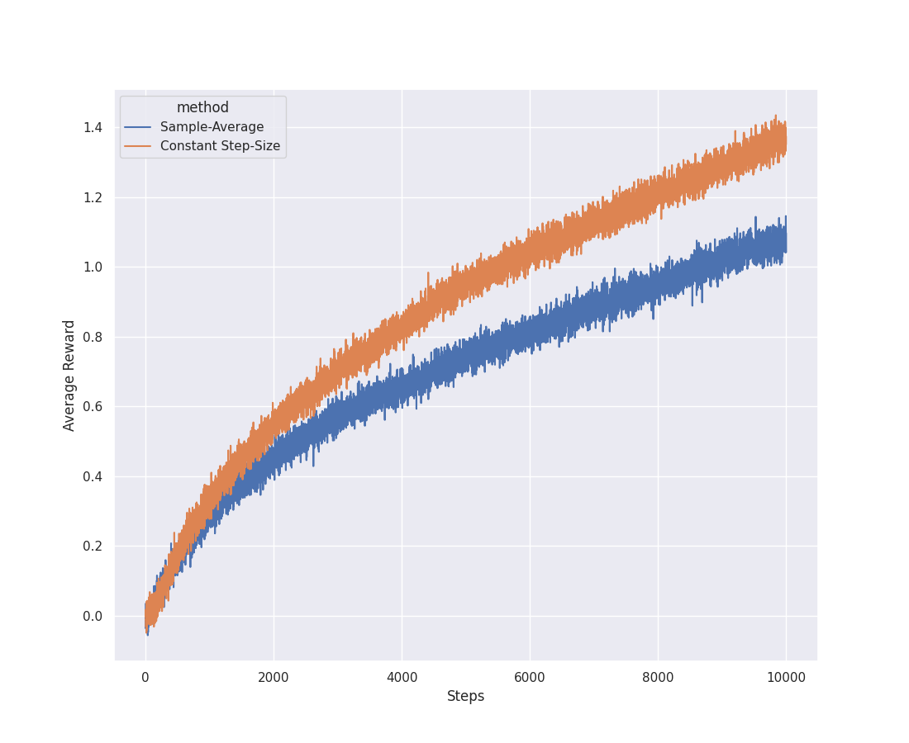
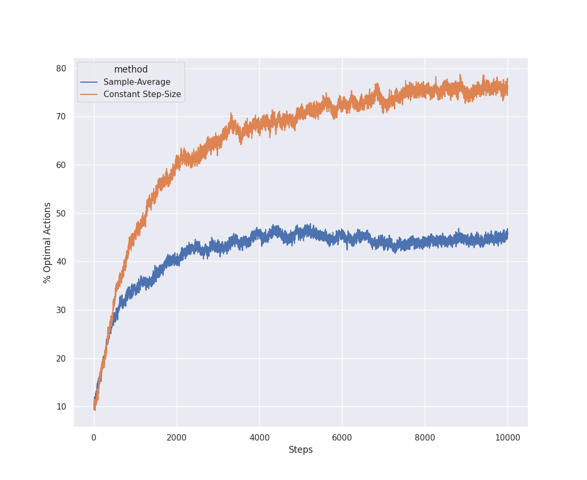

# Overview
This is an expirement I conducted, as a part of reading
*Reinforcement Learning, An Introduction, 2nd edition by Andrew Barto and Richard Sutton*,
specifically Exercise 2.4. The purpose of this is to compare action-value methods using constant step-size with
action-value methods using sample averages, in a non-statinoary problem. The test bed is a k-armed bandit problem,
with k = 10

# The Experiment
This problem uses the k-armed bandits problem as the basis of testing. In this case k = 10 and all arms of the bandits
start with the action value. Once the experiment starts, each arm of the bandit takes a walk, changing its value every step.
This was done to model a non-stationary problem.

# Results

