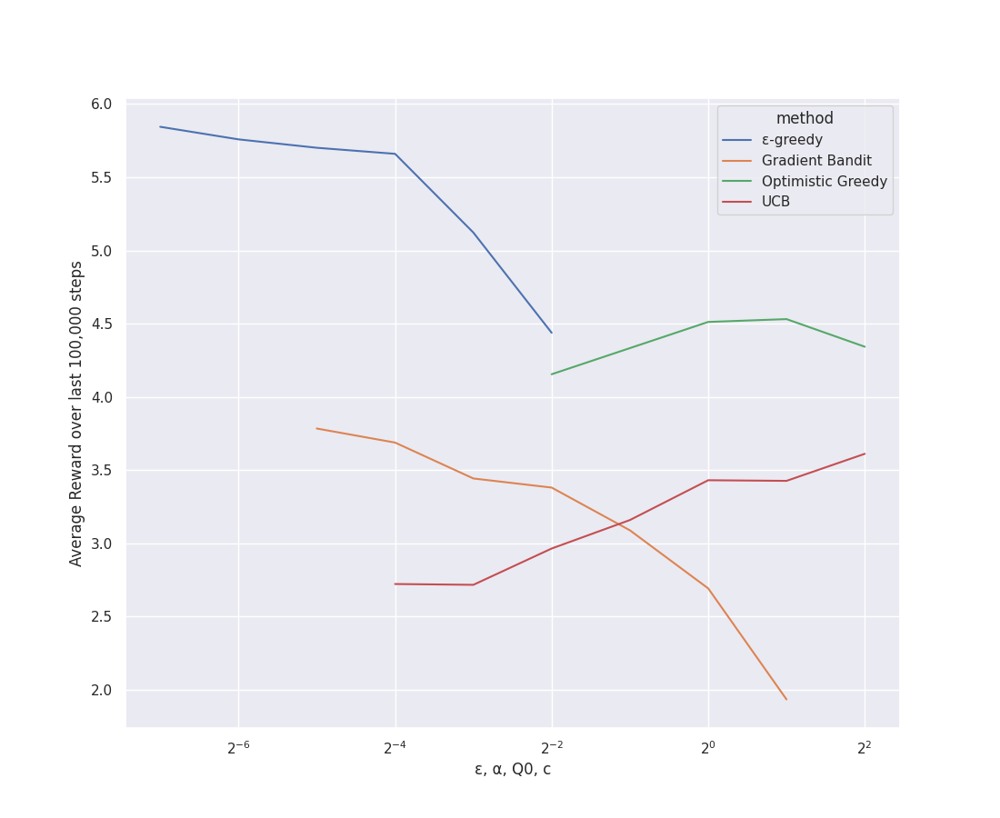

# Overview
This is an expirement I conducted, as a part of  Exercise 2.11. The purpose of this is to compare different algorithms
for maximizing the reward. The four algorithms tested
here are ε-greedy, Gradient Bandit, Optimistic Greedy and upper-confidence-bound (UCB)

# The Experiment
This problem uses the k-armed bandits problem as the basis of testing. In this case k = 10 and all arms of the bandits
start with the same action value. Once the experiment starts, each arm of the bandit takes a walk, changing its value every step.
This was done to model a non-stationary problem.

# Results

## Bandit Algorithms Compared with Different Configurations

This graph shows the average reward. over the last 100,000 steps (out of 200,000 total), for each algorithm, for each configuration values.
The configuration values are ε, α, Q0, c, corresponding to ε-greedy, Gradient Bandit, Optimistic Greedy, UCB, respectively.
